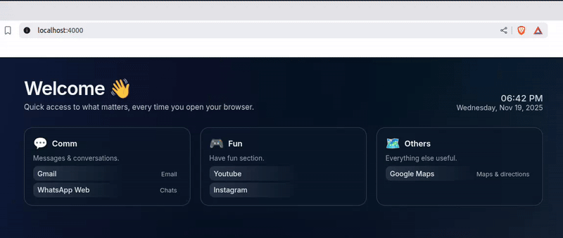

A minimal, fast personal homepage built with  to use as your browser start page.  

# 🌟 Jekyll Startpage — A Beautiful Personal Browser Homepage

A clean, modern, data-driven startpage built with [Jekyll](https://jekyllrb.com/).
Use it as your browser’s homepage or as a lightweight personal dashboard.

## 🚀 Features

✨ Elegant card-based layout

🗂 Fully data-driven via _data/links.yml

🌎 All links & section titles stored in **only one place**: `_data/links.yml`

📱 Responsive design

🎨 Easy to customize (CSS & YAML)

🕒 Local clock and date

😎 Ready to use for beginners

🔧 Can be used as a GitHub template or Jekyll remote theme


### Video Demo



---

## 🗂 Project Structure

```text
startpage/
  _config.yml          # Jekyll config (site title, description, etc.)
  _layouts/
    default.html       # Main page layout (header, footer, basic structure)
  _data/
    links.yml          # All your sections and links live here!
  assets/
    css/
      main.css         # Styles for the whole page
  index.html           # Your Home page, loops over _data/links.yml
```

## ⚙️ Setup & Usage

1. Install Jekyll (if needed)
    ```
    gem install bundler jekyll
    ```
2. Run the site locally

    From the startpage/folder:
    ```
    jekyll serve
    ```
    or, if using Bundler:
    ```
    bundle exec jekyll serve
    ```
    Jekyll will tell you the local URL, usually: http://127.0.0.1:4000.

3. Use it as your browser homepage

    You have two options:

    1. Point your browser homepage to the local URL (easiest): e.g. http://127.0.0.1:4000/

    2. build static files and point to a local file:
        ```bash
        JEKYLL_ENV=production bundle exec jekyll build
        ```
        Then set your browser homepage to the generated file: `startpage/_site/index.html`.

## 🚀 Quick Start (Using as a Template)

If you're viewing this on GitHub:

**1.** Click **Use this template** (big green button on the repo page)

**2.** Choose **Create a new repository**

**3.** Clone your newly created repo:
  ```
  git clone https://github.com/<your-username>/<your-repo>.git
  ```

**4.** Install dependencies:
  ```
  gem install bundler jekyll
  ```

**5.** Run the site on local:

  ```
  bundle exec jekyll serve
  ```

**6.** Open your browser and go to:
  ```
  localhost:4000
  ```
  Use and test your homepage.

**7.** Stop the serve (step 5) and build the final version of your homepage:
  ```
  JEKYLL_ENV=production bundle exec jekyll build
  ```

**8.** Finally, on your browser configurations, set your homepage to the generated file: `<root_path_to_your_homepage>/_site/index.html` and you’re done! 🎉


## 🧩 How the Data Works

All sections and links are defined in: `_data/links.yml`. To add or modify links, you **only edit this file**.

No HTML/CSS changes required. No coding needed.

Example:
```text
sections:
  - id: my_section_id
    title: "My Section Title"
    icon: "🥇"
    description: "Any useful description."
    links:
      - label: "A Website"
        url: "https://www.a-website.com"
        hint: "An useful website"
  - id: my_second_section_id
    title: "My Second Section Title"
    icon: "🥈"
    description: "Any useful description."
    links:
      - label: "A Second Website"
        url: "https://www.a-second-website.com"
        hint: "Another useful website"
```

What each field means:

 - **id**: technical name, also used as the HTML id for the section
 - **title**: visible section title
 - **icon**: emoji (or HTML) shown next to the title
 - **description**: small text under the title
 - **links**: list of links with:
    - **label**: link text
    - **url**: where it goes
    - **hint**: small secondary text on the right

## 🛠 Maintaining the Page

### Add a new section

In `_data/links.yml`, just add a new block under `sections:`:
```text
  - id: fun
    title: "Fun"
    icon: "🎮"
    description: "Relax and enjoy."
    links:
      - label: "YouTube"
        url: "https://www.youtube.com"
        hint: "Videos"
      - label: "Reddit"
        url: "https://www.reddit.com"
        hint: "Communities"
```

### Add a new link to an existing section

Just add another item under links:
```text
  - id: fun
    title: "Fun"
    icon: "🎮"
    description: "Relax and enjoy."
    links:
      - label: "MY NEW LINK LABEL"
        url: "MY_LINK.COM"
        hint: "MY LINK"
```

## 🎨 Changing the Look & Feel

Everything is in `assets/css/main.css`. There you modify colors, spacing, radiuses, gradients, fonts—everything is customizable.

## 🔣 Changing Section Icons

Icons are stored in the icon field of each section, example:
```text
icon: "💬"
```
You can replace these with any emoji, that you can get in https://emojipedia.org/, for example.

## 📦 Using as a Remote Theme (Optional)

You can make this project usable as a remote Jekyll theme by adding this to a repo’s `_config.yml`:

```yaml
remote_theme: <your-username>/<your-repo>
```

This is great if:

- You want to keep styling & layout upstream
- And only override _data/links.yml
